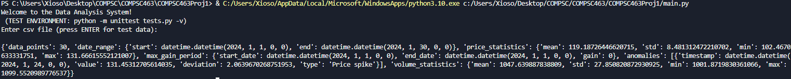
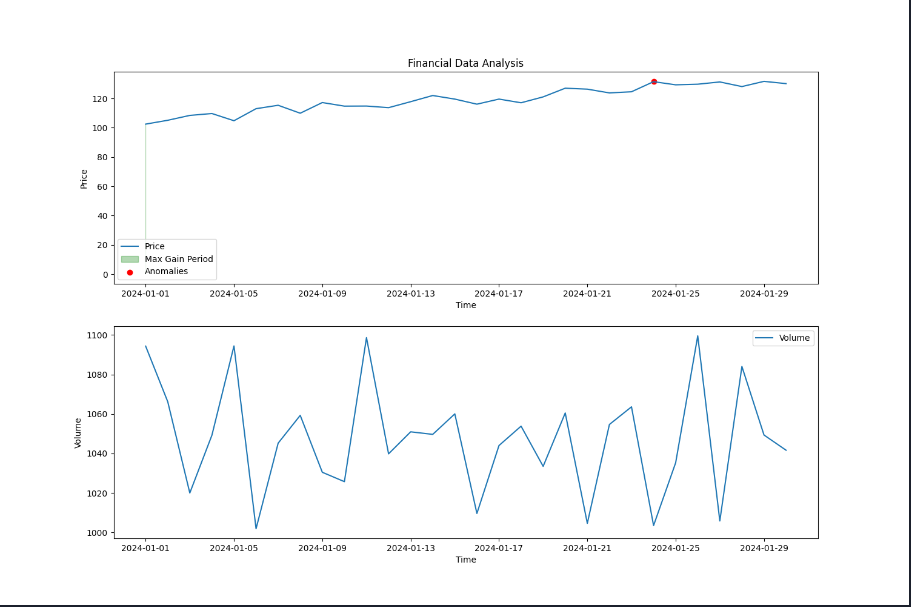
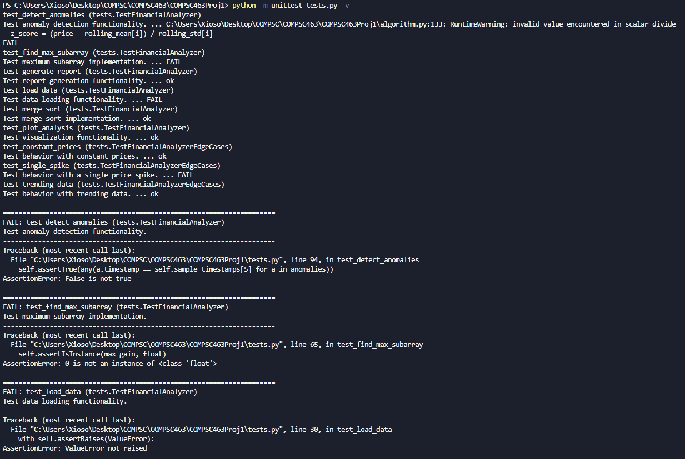

# COMPSC463Proj1
Project Repository for COMPSC463 Project 1.

# Description of the project

*Problem Description*

Develop a system that analyzes large financial datasets (e.g., stock prices, transaction logs, or cryptocurrency data) to detect patterns, trends, and anomalies. The system will use divide-and-conquer techniques to efficiently process, analyze, and report on financial data for decision-making purposes.

*Key components and algorithms*

- Merge sort for time-series data processing
- Using merge sort, you can efficiently sort massive datasets
- Sorting financial transactions based on timestamps, or arranging stock prices to detect trends and compute moving averages.
- Divide-and-conquer algorithm for maximum subarray (Kadane’s Algorithm for 1D & 2D)
- To identify the period of maximum gain or loss, the maximum subarray problem can be solved using a divide-and-conquer approach. It breaks down the stock price changes over time to find the subarray (period) where the profit is maximized.
- This can be used to analyze stock performance over time, detect when stocks or assets have shown the best growth, or even identify periods of financial crisis.
- Fast closest pair of points for anomaly detection
- When analyzing large transaction logs or high-frequency trades, the closest pair of points algorithm can help detect anomalies by identifying trades or prices that deviate significantly from the norm.
- Detecting unusual spikes or dips in trade prices, volumes, or transaction times, which could signal fraud or other financial irregularities.
 

*Outline of the Project (These steps provide the overall expected works. You do not need to follow steps in the same way)*

- Input: A large dataset of stock prices, cryptocurrency prices, or transaction logs.
- This data can be sourced from public financial data APIs or historical datasets (e.g., daily stock prices over a year or millions of cryptocurrency transactions).
- Step 1: Sort the data using Merge Sort.
- Sort stock prices or transaction logs by time to prepare the dataset for further analysis.
- This will ensure that subsequent operations (e.g., trend detection, anomaly detection) can be done efficiently on a sorted dataset.
- Step 2: Find periods of maximum gain or loss using divide-and-conquer maximum subarray.
- Apply the divide-and-conquer version of Kadane’s algorithm to find the sub-period where stock price or transaction volumes exhibited maximum gains (or losses).
- Extend this algorithm to handle 2D arrays (e.g., analyzing two different stocks or comparing stock data across two different regions).
- Step 3: Detect anomalies using closest pair of points.
- Use a divide-and-conquer closest pair of points algorithm to find anomalies in transaction logs or price fluctuations. For instance, it can detect unusual deviations in transaction prices or times compared to historical data.
- This can help in fraud detection or identifying unusual market behavior.
- Step 4: Generate Reports.
- Create reports showing the periods of maximum profit or loss, trends in stock or transaction prices, and detected anomalies.
- You can visualize the results using line graphs or tables that highlight the key findings (e.g., the period with the largest gain or anomaly).
- Output: The system generates detailed reports or graphs summarizing stock market trends, periods of high performance, or suspicious financial transactions.

# Code Structure
report_images (Not relevant to application) 
    └── image-1.png 
    └── image-2.png 
    └── image.png 

COMPSC463Proj1 
    └── main.py 
    └── algorithm.py 
    └── tests.py 

- main.py: Driver code for the application.

- algorithm.py: Contains the various algorithms used to produce the analysis results based on the data.
  - Classes:
    - FinancialDataPoint: Stores a single point of financial data
    - AnomalyReport: Stores information about detected anomalies
  - Methods:
    - load_data: Initializes the analyzer with financial data
      - load_csv: Loads given CSV file and passes data into `load_data()`
    - merge_sort: Implementation of merge sort with O(n log n) complexity; Sorted list of FinancialDataPoint objects
      - _merge: Helper function for merge sort
    - find_max_subarray: Finds period of maximum gain using divide-and-conquer
    - detect_anomalies: Uses rolling statistics and z-scores for detection of unusual price movements
    - generate_report: Combines results from all analysis functions

- tests.py: Test cases for application functions.

# Tutorial

*Required Installs*
pip install numpy pandas matplotlib

*Guide*
- Run `git clone https://github.com/MajaSLash/COMPSC463Proj1.git` in your terminal to download this repository.
- Download a dataframe from Kaggle to a CSV file (Instructions linked [here](https://www.kaggle.com/discussions/getting-started/58426)).
- Move the file into this project's directory.
- Run the program from main.py
- When prompted, enter the filename into the project.
- To use the test case suite, run `python -m unittest tests.py -v` in your terminal.

# Test Cases

*Main Program Test Cases*
The test case option for the main program can be accessed when no CSV file is entered. This will generate random data to be inserted into the program.
- Example Usage:
  - Output: 
  - Chart: 

*Test Cases for Individual Parts*
Indiviudal Cases for each function are located in test.py
- Example Usage:
  - Output: 
# Conclusion
This project has helped demonstrate the usefulness of the material learned in COMPSC463 so far in the semester. The program utilized the many different algorithms and general coding ability of the student in order to successfully complete it. The inclusion of the different algorithms did not feel too out of place, as well as the project topic felt natural to what could be encountered in the development industry. One improvement that could be added to this project (as it was not needed, but I included anyway in my version) is the importance of the built-in test cases. This improves efficiency for the grader, as they do not have to insert values manually into the program in order to validate the program and instead can have the option of a "TEST" mode.